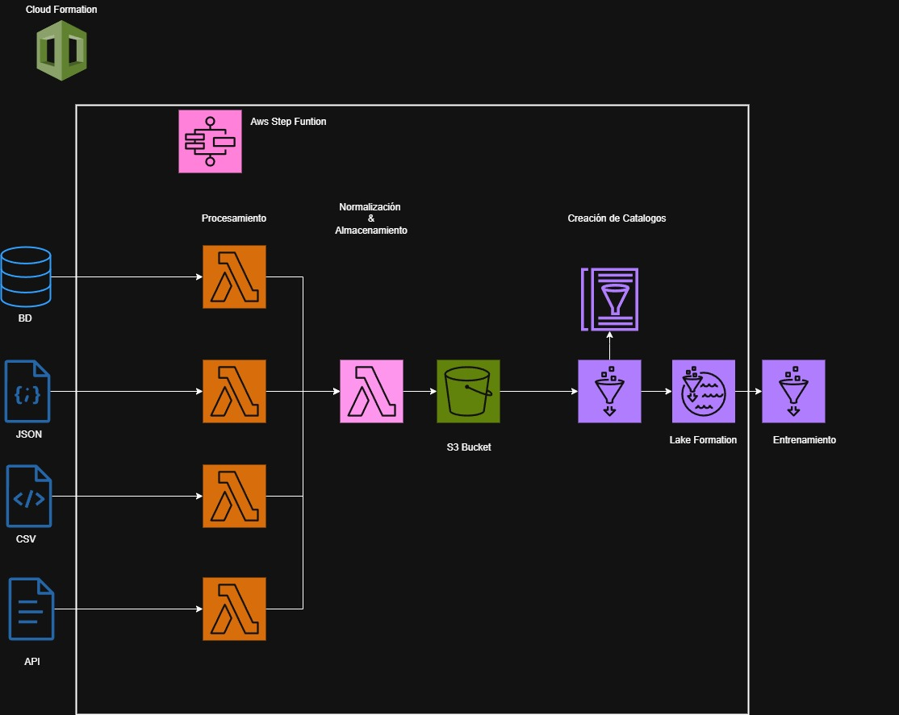

# AWS

Este repositorio es un espacio donde recopilo mi aprendizaje sobre **Amazon Web Services (AWS)**, incluyendo tanto la parte teórica como ejercicios prácticos. Es mi forma de estructurar y reforzar conocimientos mientras avanzo en el mundo de la computación en la nube.

## 📌 Contenido

- 📖 **Documentación teórica** sobre los servicios de AWS.  
- 🛠️ **Ejercicios y proyectos prácticos** que realizo.  
- 🔍 **Recursos y notas personales** para el aprendizaje continuo.  

## ⚙️ ETL Serverless con AWS

Adicionalmente, pueden observar la **solución que se le dio al ETL serverless**, el cual se enfoca en una arquitectura que:
- **Extrae información desde 4 fuentes de datos** (JSON, CSV, API y base de datos).
- Utiliza **funciones Lambda** para orquestar y transformar los datos.
- Normaliza los datos para unificar su estructura.
- Almacena los resultados en un bucket S3.
- Finalmente, se analizan usando **AWS Glue y Athena** para facilitar la consulta y análisis.

Este flujo fue diseñado bajo una arquitectura completamente **serverless**, escalable y modular.

📊 El flujo diseñado se puede observar en el siguiente diagrama:

